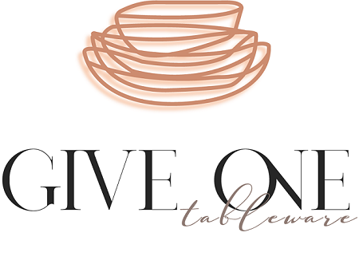

# GIVE ONE
# 

## **Comisión 9**

---
## **Grupo 1**
___

## **Temática**
Somos Give One una empresa argentina dedicada a la venta de vajillas, cristalería y cubiertos para todo el país de manera rápida, segura y eficaz a través de la venta online.
Contamos con una amplia gama de productos para satisfacer la demanda de nuestros clientes.
Vendemos al por mayor y menor ,para casas de hogar, hoteles, restaurantes y empresas. Brindamos asesoramiento personalizado a nuestros clientes mediante un Staff de venta y administración, proporcionando las mejores soluciones a sus compras.

Buscamos que nuestros clientes reconozcan siempre nuestros objetivos de trabajo:

Calidad de atención, originalidad y calidad de producto, entrega inmediata y stock permanente.

Ante cualquier dudas, nos podes escribir a give@one.com.ar

### **Integrantes:**
- Gabriel Calla, 29 años.
  
   Gerente de Publicidad.
___

- Cintia Serrano, 30 años.
  
   Ejecutiva de Ventas.
___

- Lucas Avalos, 25 años.

  Gerente de Desarrollo.

___
- Carolina Vega, 24 años.
  
  Jefa de diseño.

### **Referencias**
- [Volf](https://www.volf.com.ar)

- [Beck&Martin](https://www.beck-and-martin.com.ar/)

- [Potiers Home](https://www.potiershome.com.ar)

- [San Carlos Cristaleria](http://www.san-carlos.com.ar/)

- [Mercado Libre](https://www.mercadolibre.com.ar/)

Elegimos estás páginas web por el diseño de la interfaz de sus páginas. Volf cuenta con una estética agradable para el comprador. Beck&Martin y Portiers Home disponen de una buena presentación y catálogo de sus productos. San Carlos Cristaleria cuenta con detalles en el producto específicos. Mercado Libre cuenta con una buena estructura de carrito de compras.

### **Tipografías:**

- Roboto  

- Kanit    

- Open Sans    

### **Colores:**

- Verde: #24cf5f                          

- Gris: #f0f0f0                             

- Marrón: #c9b391                             

### **Links de trabajo**
* [GITHUB](https://github.com/GabrielC92/grupo_1_giveone.git)
* [TRELLO](https://trello.com/b/WIncPfZi/proyecto-give-one-grupo-1-c9)
